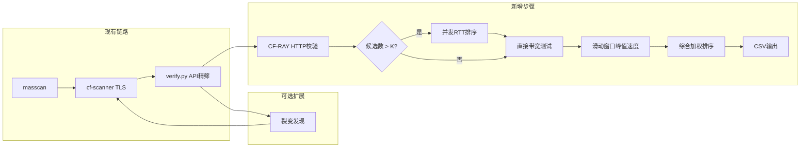
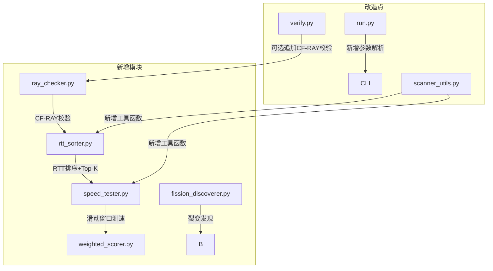

# 测速优选管道优化

Feature Name: speedtest-optimization
Updated: 2026-06-30

## Description

在 IP-Tidy 现有扫描链路末端，新增 4 个可选优化步骤，形成一条增强型优选管道。用户通过新命令行标志独立启用各步骤，不改变现有默认行为。

核心链路变化：

```
现有: masscan → cf-scanner(TLS) → verify.py(API) → cfst(外部) → CSV
新增:                    ↓              ↓              ↓
                    CF-RAY校验    RTT排序+Top-K   自实现滑动窗口速度测速
                    裂变发现(可选)     ↓
                                  综合加权排序 → CSV
```

## Architecture



### 模块关系



## Components and Interfaces

### 1. CF-RAY 校验模块 (`ray_checker.py`)

**输入**: `verified.txt` 中的 IP:端口列表（来自 verify.py 输出）
**输出**: 追加 `CF-RAY` 校验结果，标记数据中心代码

**接口**:
```
def ray_check(
    candidates: list[str],
    concurrency: int = 32,
    timeout: int = 10,
    fallback: bool = True
) -> list[RayCheckResult]:
```

**`RayCheckResult` 结构**:
```python
@dataclass
class RayCheckResult:
    ip: str
    port: int
    ray_present: bool          # CF-RAY 头是否存在
    colo: str                  # 数据中心 IATA 码
    http_latency_ms: float     # HTTP 请求延迟
    error: Optional[str]       # 错误信息
```

**实现方案**:
- 对每个候选 IP:端口，发起 `GET https://cloudflare.com/cdn-cgi/trace` 请求
- 使用 `Host` 头指定域名，`CURLOPT_CONNECT_TO` 等价方式（Python 通过 `socks` 或自定义 `create_connection` 实现域名→IP 强制绑定）
- 检查响应头 `CF-RAY` 是否存在，从值中提取 `-` 后的三字码头
- 支持并发，使用 `ThreadPoolExecutor` + `aiohttp` 或 `urllib3` 连接池
- 失败时根据 `fallback` 参数决定是否保留原始结果

### 2. RTT 排序模块 (`rtt_sorter.py`)

**输入**: 候选 IP 列表
**输出**: 按 RTT 升序排序的前 K 个 IP

**接口**:
```
def rtt_sort(
    candidates: list[str],
    top_k: int = 10,
    concurrency: int = 50,
    samples: int = 3,
    port: int = 443
) -> list[RttResult]:
```

**`RttResult` 结构**:
```python
@dataclass
class RttResult:
    ip: str
    port: int
    rtt_avg_ms: float           # 3 次 TCP 握手平均延迟
    rtt_min_ms: float           # 最小延迟
    rtt_std_ms: float           # 延迟标准差（抖动指标）
    reachable: bool             # TCP 是否可达
```

**实现方案**:
- 使用 `socket.create_connection` 或原始 TCP `connect()` 测量握手时间
- 每次连接设置短超时（默认 3 秒）
- 3 次测量取平均，同时记录最小值和标准差
- 使用 `ThreadPoolExecutor` 并发池，默认 50 线程
- 按 rtt_avg 升序排序，截取前 K 个
- 不可达 IP 直接过滤

### 3. 滑动窗口速度测速模块 (`speed_tester.py`)

**输入**: RTT 排序后的 Top-K IP
**输出**: 每个 IP 的峰值速度、实测带宽、数据中心

**接口**:
```
def speed_test(
    candidates: list[RttResult],
    target_url: str = "https://speed.cloudflare.com/__down?bytes=100000000",
    bandwidth_target: int = 50,   # Mbps
    window_seconds: int = 1,
    timeout: int = 30
) -> list[SpeedTestResult]:
```

**`SpeedTestResult` 结构**:
```python
@dataclass
class SpeedTestResult:
    ip: str
    port: int
    peak_speed_kbps: float       # 滑动窗口峰值速度 (kB/s)
    bandwidth_mbps: float        # 实测带宽 (Mbps)
    rtt_avg_ms: float            # 前序 RTT 结果
    colo: str                    # 数据中心
    http_latency_ms: float       # HTTP 请求总延迟
    bytes_downloaded: int        # 实际下载字节数
    duration_sec: float          # 测速耗时
```

**实现方案**:
- 使用 `requests` 或 `urllib3` 的流式响应 + 分块读取
- 每次读取 64KB 数据块，记录时间戳
- 1 秒滑动窗口：计算过去 1 秒内累计下载字节数 / 1 秒 = 瞬时速度
- 遍历整个下载过程，记录瞬时速度最大值
- 下载目标：`speed.cloudflare.com/__down?bytes=N`，N 为 100MB
- 一旦达到用户设定的带宽阈值（默认 50 Mbps），可提前终止该 IP 测速
- 同时发起 HTTP 请求，检查 `CF-RAY` 头提取数据中心
- 串行（逐个 IP）测速，避免带宽争抢影响测量准确性

**滑动窗口算法**:
```python
def _peak_speed(read_iter, window_sec=1.0):
    window: deque[tuple[float, int]] = deque()
    peak = 0.0
    for chunk in read_iter:
        now = time.time()
        window.append((now, len(chunk)))
        # 移除窗口外的数据点
        while window and window[0][0] < now - window_sec:
            window.popleft()
        # 计算窗口内瞬时速度
        window_bytes = sum(b for _, b in window)
        window_dur = min(window[-1][0] - window[0][0], window_sec) if len(window) > 1 else window_sec
        speed = window_bytes / max(window_dur, 0.001) / 1024  # kB/s
        peak = max(peak, speed)
    return peak
```

### 4. 综合加权排序模块 (`weighted_scorer.py`)

**输入**: 速度测试结果
**输出**: 按综合评分降序排列的最终列表

**接口**:
```
def weighted_sort(
    results: list[SpeedTestResult],
    weight_bandwidth: int = 3,
    weight_rtt: int = 1,
    weight_http_latency: int = 1,
    weight_jitter: int = 2
) -> list[WeightedResult]:
```

**评分公式**:
```
score = bandwidth_mbps * weight_bandwidth
      + max(0, 1000 - rtt_avg_ms) * weight_rtt
      + max(0, 1000 - http_latency_ms) * weight_http_latency
      + max(0, 500 - rtt_std_ms) * weight_jitter
```

### 5. 裂变发现模块 (`fission_discoverer.py`)

**输入**: 已验证的 CF IP 列表
**输出**: 通过 IP↔域名链式发现的新候选 IP

**接口**:
```
def fission_discover(
    seed_ips: list[str],
    max_depth: int = 2,
    max_ips: int = 1000,
    concurrency: int = 20
) -> list[str]:
```

**实现方案**:
- **阶段 1 — IP 反查域名**: 对种子 IP 并发查询 site.ip138.com、dnsdblookup.com、ipchaxun.com，提取页面中的域名列表
- **阶段 2 — 域名解析 IP**: 对反查获得的域名执行 `nslookup` 或 `socket.getaddrinfo`，解析 IPv4 地址
- 去重后与现有 IP 池合并，新 IP 进入下一轮扫描
- 最大深度 2 轮，最大 IP 数 1000

### 6. run.py 改造点

**新增命令行参数**:

| 参数 | 类型 | 默认 | 说明 |
|------|------|------|------|
| `--ray-check` | flag | false | 启用 CF-RAY HTTP 头校验 |
| `--self-speed` | flag | false | 使用自实现测速模块替代 cfst |
| `--top-k` | int | 10 | RTT 排序保留前 K 个 |
| `--bandwidth` | int | 50 | 期望带宽阈值 (Mbps) |
| `--fission` | flag | false | 启用裂变发现模式 |
| `--fission-depth` | int | 2 | 裂变最大深度 |
| `--fission-max-ips` | int | 1000 | 裂变最大 IP 数 |

**`_run_cfst_speedtest` 改造**:
- 当 `--self-speed` 启用时，跳过 cfst 二进制调用，改用自实现模块
- 当 `--ray-check` 启用时，在 verify.py 完成后追加 CF-RAY 校验
- 当 `--self-speed` 启用时，内部先调用 RTT 排序 → Top-K 截取 → 滑动窗口测速 → 加权排序

## Data Models

### 增强版 CSV 输出

现有 CSV 头部：
```
IP地址,端口,TLS,数据中心,地区,城市,网络延迟,下载速度,ASN,协议
```

增强版新增列：
```
IP地址,端口,TLS,数据中心,地区,城市,网络延迟,下载速度,峰值速度,HTTP延迟,抖动,综合评分,ASN,协议
```

### 中间文件格式

```
.cf_ray_checked.txt  — CF-RAY 校验通过列表
.rtt_sorted.txt      — RTT 排序结果 (含延迟/抖动)
.speed_test.txt      — 速度测试结果 (含峰值速度/带宽)
```

## Correctness Properties

1. **CF-RAY 校验不误杀**: 对于拒绝 HTTP 请求的 IP（如只开放 TLS 的节点），降级到备用的 verify.py API 通道，不因 CF-RAY 检查失败而丢弃
2. **RTT 排序不丢精度**: 3 次 TCP 握手取平均，标准差过大（>500ms）的 IP 标记为高抖动，不影响排序准确性
3. **滑动窗口不低估峰值**: 窗口大小固定 1 秒，保证足够细粒度捕捉瞬时峰值，同时避免单次 I/O 抖动误报
4. **加权排序无选路偏差**: 权重因子固定，不因少量 IP 的极端值扭曲整体排名
5. **裂变发现不溢出**: 严格限制最大深度和最大 IP 数，防止无限循环

## Error Handling

| 组件 | 错误场景 | 处理策略 |
|------|----------|----------|
| CF-RAY 校验 | HTTP 超时 / 连接拒绝 | 降级：保留原始 verify.py 结果，标记 colo 为空 |
| CF-RAY 校验 | 响应无 CF-RAY 头 | 降级：标记 ray_present=False，保留原始结果 |
| RTT 排序 | TCP 连接超时 | 过滤：标记 reachable=False，从候选移除 |
| RTT 排序 | 全部不可达 | 跳过：直接进入带宽测试，无需 RTT 排序 |
| 速度测试 | 下载中断 | 重试：最多 1 次重试，失败则跳过该 IP |
| 速度测试 | 全部失败 | 回退：使用 cfst 二进制作为备选方案 |
| 裂变发现 | 反查网站不可用 | 轮换：3 个数据源逐个尝试，全部失败则跳过本轮 |
| 裂变发现 | DNS 解析失败 | 跳过：对失败域名不报错，继续处理其他域名 |

## Test Strategy

### 单元测试
- `ray_checker.py`: 模拟 HTTP 响应含/不含 CF-RAY 头，验证校验逻辑
- `rtt_sorter.py`: mock TCP 连接延迟，验证排序和 Top-K 截取
- `speed_tester.py`: mock 流式响应，验证滑动窗口峰值计算
- `weighted_scorer.py`: 验证不同权重组合下的排序结果
- `fission_discoverer.py`: mock 反查和 DNS 解析，验证裂变逻辑

### 集成测试
- 完整链路：`masscan → cf-scanner → verify.py → ray_check → rtt_sort → speed_test → weighted_sort`
- 对比测试：自实现测速模块 vs cfst 二进制，结果偏差 < 20%
- 降级测试：逐个模拟各外部依赖不可用，验证降级路径

### 回归测试
- 不启用任何新标志时，输出与现有版本完全一致
- 启用 `--self-speed` 但不启用 `--ray-check`，只影响测速步骤
- 启用 `--ray-check` 但 API 精筛失败，CF-RAY 作为独立通道

## References

- [better-cloudflare-ip (badafans)](https://github.com/badafans/better-cloudflare-ip) — CF-RAY 校验、滑动窗口峰值速度、RTT 排序 + Top-K
- [better-cloudflare-ip (fscarmen)](https://github.com/fscarmen/better-cloudflare-ip) — 并发 RTT 实现、libcurl 强制 DNS 绑定、内置 fallback 设计
- [CloudflareCDNFission](https://github.com/snowfal1/CloudflareCDNFission) — 裂变式 IP↔域名发现、三源轮换容错
- [cfnb](https://github.com/xinyitang3/cfnb) — 多源聚合、加权排序算法、DNS 推送